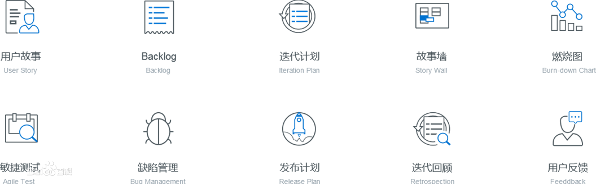

# 云或移动项目管理服务软件--调查与研究

> Proudly Presented by Invincible Inc.

- [云或移动项目管理服务软件--调查与研究](#%e4%ba%91%e6%88%96%e7%a7%bb%e5%8a%a8%e9%a1%b9%e7%9b%ae%e7%ae%a1%e7%90%86%e6%9c%8d%e5%8a%a1%e8%bd%af%e4%bb%b6--%e8%b0%83%e6%9f%a5%e4%b8%8e%e7%a0%94%e7%a9%b6)
  - [一、产品对比分析](#%e4%b8%80%e4%ba%a7%e5%93%81%e5%af%b9%e6%af%94%e5%88%86%e6%9e%90)
    - [1. Zoho Projects](#1-zoho-projects)
      - [I. 产品特色](#i-%e4%ba%a7%e5%93%81%e7%89%b9%e8%89%b2)
      - [II. 业务支持](#ii-%e4%b8%9a%e5%8a%a1%e6%94%af%e6%8c%81)
      - [III. 内含工具](#iii-%e5%86%85%e5%90%ab%e5%b7%a5%e5%85%b7)
    - [2. CORNERSTONE](#2-cornerstone)
      - [I. 产品特色](#i-%e4%ba%a7%e5%93%81%e7%89%b9%e8%89%b2-1)
      - [II. 业务支持](#ii-%e4%b8%9a%e5%8a%a1%e6%94%af%e6%8c%81-1)
      - [III. 内含工具](#iii-%e5%86%85%e5%90%ab%e5%b7%a5%e5%85%b7-1)
    - [3. TAPD](#3-tapd)
      - [I. 产品特色](#i-%e4%ba%a7%e5%93%81%e7%89%b9%e8%89%b2-2)
      - [II. 业务支持](#ii-%e4%b8%9a%e5%8a%a1%e6%94%af%e6%8c%81-2)
      - [III. 内含工具](#iii-%e5%86%85%e5%90%ab%e5%b7%a5%e5%85%b7-2)
    - [对比分析](#%e5%af%b9%e6%af%94%e5%88%86%e6%9e%90)
  - [二、产品使用设想](#%e4%ba%8c%e4%ba%a7%e5%93%81%e4%bd%bf%e7%94%a8%e8%ae%be%e6%83%b3)
  - [三、盈利模式分析](#%e4%b8%89%e7%9b%88%e5%88%a9%e6%a8%a1%e5%bc%8f%e5%88%86%e6%9e%90)
    - [1. Zoho Projects](#1-zoho-projects-1)
    - [2. CORNERSTONE](#2-cornerstone-1)
    - [3. TAPD](#3-tapd-1)
    - [对比分析](#%e5%af%b9%e6%af%94%e5%88%86%e6%9e%90-1)

目前市面上的“云或移动项目管理服务软件”比比皆是。作业说明中特别提到的“Agilo for Scrum”，经调查发现已不维护，转由“Agilo for Trac”提供服务。

经筛选，在此选择以下软件进行分析：
- __Zoho Projects__： 所有者：Zoho Corporation， [Zoho Projects官网-项目管理](https://www.zoho.com.cn/projects/)、[Zoho Projects官网-IT项目管理](https://www.zoho.com.cn/projects/it-project-management.html)
- __CORNERSTONE__： 所有者：深圳市基石协作科技有限公司， [CORNERSTONE官网](https://www.cornerstone365.cn/)
- __TAPD__：所有者：腾讯公司， [TAPD官网](https://www.tapd.cn/)

值得一提的是，TAPD是腾讯旗下的一站式敏捷研发协作云平台，对软件项目管理比较友好。

## 一、产品对比分析
> 完成建议：到每个产品的官网上获取信息，必要时可截图，但 __不要只贴截图不说明__ 。可能会发现产品的功能、服务比较相似，这时没必要执意找不同，按事实叙述即可，毕竟同类软件功能相似很正常。在对比分析时，共性、特性都应涉及到。

### 1. Zoho Projects

#### I. 产品特色

  - Zoho项目是一个功能丰富的在线项目管理工具，提供综合的项目管理方案，从而简化和加速项目的管理进程。它具有协作和bug跟踪功能，可以帮助团队聚集在一起，释放团队的潜力，更快地完成工作。
  
  - 它与一些专用的项目管理软件不同，它是多个项目管理软件的集合，它是一个展示相关项目文档、已存储的内容、最新提交的更新、大家交换意见以及完成工作的集中区域。其中任务管理、社交性项目协作工具、图标和报告、项目时间追踪、问题追踪和工作流中所需要的功能应有尽有。
  
  - 另外它还具有简单易上手的特点，功能丰富的同时还完美地保证了界面的整洁性，使项目团队更高效地完成任务。

#### II. 业务支持

- 项目计划管理

  - 支持通过里程碑、任务列表、任务、子任务等分类，将复杂的项目分解为易于管理的小部分；

  - 支持从“依赖关系视图”或从甘特图来管理任务依赖关系；

  - 支持将 Microsoft 项目文件导入 Zoho；

  - 支持用看板让每个人都了解项目进展帮助糊精准把控任务进度。

- 项目流程自动化管理 - 蓝图

  - 支持拖拽创建流程，无需写代码；

  - 支持自动通知相关人员做下一步任务；

  - 支持邮件自动通知。

- 项目工时管理

  - 支持统计计费工时数；

  - 支持多格式导出项目工时表；

  - 支持创建账单，发送给客户；

  - 支持建立工时表账单状态；

  - 支持任务计时器。

- 项目Bug管理

  - 支持提交/整理项目问题，Zoho Projects的Bug跟踪系统允许管理员根据Bug所处状态配置员工操作权限，更改Bug状态，或删除Bug，简化Bug跟踪步骤；

  - 支持创建自定义Bug工作流；

  - 支持项目进展即时通知；

  - 支持定义业务规则，在满足特定条件时系统能够自动执行某些操作，例如更改bug严重等级、优先级、模块，将bug分配给某员工等；

  - 支持设置bug严重等级，如可以创建标签，将bug分组；

  - 支持“我的bug”视图。

- 项目报表功能

  - 支持项目管理软件无缝集成报表软件；

  - 支持预置项目报表和统计图表；

  - 支持追踪关键项目指标；

  - 支持项目报表发送、导出&打印。

#### III. 内含工具

- 看板查看

- 蓝图

- 甘特图与报表

- 日历查看

- 论坛交流

- 项目“内网”——知识库

### 2. CORNERSTONE

#### I. 产品特色

- CORNERSTONE是一个一站式项目管理协作平台，帮助企业进行智能管理，解决研发项目管理痛点，持续交付与集成，透过各个维度跟踪记录项目进度，帮助团队轻松配合完成目标。CORNERSTONE提供敏捷、任务、需求、缺陷、测试管理、WIKI、共享文件和日历等功能模块，帮助企业完成团队协作和敏捷开发中的项目管理需求；更有甘特图、看板、思维导图、燃尽图等多维度视图，帮助企业全面把控项目情况。数据智能化、一站式管理、高度可定制化以及极简式使用体验是CORNERSTONE的亮点。

#### II. 业务支持

- 协作管理
  - 多元化看板
  - 思维导图
  - 在线文档
  - 仪表盘
  - 共享文件
- 项目管理
  - 需求规划
  - 迭代追踪
  - 测试用例
  - 测试计划
  - 任务工时
- 构建与交付
  - DevOps
  - CMDB
  - 代码助手
  - 持续集成
  - 企业设置
  - 流程定制化

#### III. 内含工具

- 看板查看

  

- 任务管理

  

- 测试管理

  

- 在线文档

  

- 思维导图

  

- 甘特图

  

  

### 3. TAPD

#### I. 产品特色

* TAPD是一款针对软件敏捷开发的项目管理软件，是腾讯敏捷产品研发平台，强调敏捷迭代、小步快跑。使用范围包含腾讯和腾讯的合作伙伴，是腾讯敏捷研发的精髓，支撑腾讯数以万计的产品研发和协同。敏捷研发功能特点包含需求、迭代、缺陷、测试计划／用例、发布评审、看板等，而从这些要求来看TAPD都满足了使用者的需求。他的文档可实时协作，工作流管理员可自由配置，同时也不用担心维护和文件安全问题，是敏捷开发软件的代表之一。

#### II. 业务支持

* TAPD提供看板、在线文档、敏捷需求规划、迭代计划&跟踪、任务工时管理、缺陷跟踪管理、测试计划&用例、持续集成、持续交付&部署等丰富的可配置功能，并提供三种敏捷协作解决方案，满足不同客户场景需要：
	* 轻量协作解决方案：适用于不同行业协作场景，满足任务协同，文档协作和沟通交流的场景所需，帮助团队可视化工作进展、沉淀分享项目知识、提升团队协作效率。
	
	
	* 敏捷研发解决方案：专为产品研发场景打造，针对研发痛点，提供贯穿敏捷研发生命周期的一站式服务，帮助团队提升研发效率，高质量交付成功产品。
	
	
	* Devops解决方案：专为DevOps持续交付场景打造，深度整合研发工具链，助力团队高效、可靠地构建与发布产品，快速交付用户价值。
	
	
#### III. 内含工具

* 看板查看

* 文档处理

* 报表查看

* 成员分布管理

### 对比分析

> 完成建议：TAPD是针对软件敏捷开发的，相比前两个应该有一定特性。而前两个应该有较多共性

## 二、产品使用设想

> 从上述软件产品中，我们选择TAPD产品界面表达假想项目产品的使用
，并给出简单的未来产品使用描述。

### 假想使用场景1：企业管理

用户A是一位企业家，想注册一家IT企业，组建团队进行项目开发。

我们的软件支持用户注册企业、管理级别信息、注销企业，并集成常见的企业层面的功能，例如成员管理，邀请员工加入企业，给员工进行分组；权限管理，包括添加删除管理员，权限转让；项目管理，包括创建删除等基本功能；安全管理、日志查询等其他功能。

用户A首先使用企业注册功能注册企业，然后通过成员管理功能快速组建团队，通过项目管理功能快速开始项目开发，通过权限管理、安全管理等功能轻松实现企业管理。

### 假想使用场景2：项目管理

用户B是一位项目经理，需要管理手下众多项目以及员工，需要实时设计并把控项目实施的流程进度

我们的软件支持用户对项目进行管理，包括项目创建和删除、需求管理（添加、修改、删除，分组和查询等常见功能）、迭代管理（查看当前迭代，新增迭代，结束当前迭代，以及规划、工作分配等常见功能）、看板（放置通知、进度、工作安排等项目信息）、缺陷管理（添加、分组、删除、排序、查询等常见功能）

用户B利用我们的软件可以方便地管理多个项目，需求管理和迭代管理帮助他把控项目流程和进度，看板方便他和员工进行沟通。

### 假想使用场景3：成员工作界面

用户C是一名员工，在工作中需要编辑代码，也需要处理文档，还和同事经理需要进行沟通

我们的软件支持员工进行代码编辑（集成语言解析器以及git），带有文档报表处理功能，同时还具备实时通讯软件的基础功能，以及多人视频会话的 功能

使用我们的软件，员工C不需要在做不同工作的时候切换不同的专用软件，提高工作效率

### 假想使用场景4：文档报表处理

无论是员工还是经理，都需要阅读和处理大量的文档报表

我们的软件支持用户在当前软件进行文档编辑，集成常用文档处理软件的功能，例如文档导入导出、文档共享、生成报表、生成思维导图等，也支持将项目的重要数据（例如工作量，缺陷数，需求分布等）进行可视化

员工之间通过文档共享进行协同开发，通过生成报表功能减少编写文档报表花费的时间，

经理通过数据可视化可以实时掌握项目进度，了解每位员工的工作量，通过生成报表功能快速向员工下发通知或者向老板提交报告

### 未来产品功能扩展1：通过网盘管理文件

文件是企业非常重要的知识资产，日常工作中产生的文件有些是临时性文件而有的却是企业需要长期留存的重要文件。通过新增【网盘】功能提供无限存储空间，满足企业存储、版本管理、协作等需求。网盘提供企业网盘和个人网盘两种存储形式，企业网盘主要存储公司或部门文件，需要与其他成员分享或协作，个人网盘存储个人文件。企业网盘中文件的存储范围有两种：公开和私有，分别对应不同的权限。

公开网盘顾名思义就是全员公开，大家都可以看到的网盘，可以用于存储公司制度、企业文化等相关资料

私有网盘中的资料只有加入的成员才可以看到，另外，还可以对每个成员的权限进行设置，针对不同成员分别设置编辑、上传、下载、只读等权限，保障数据安全性；

除了以上四种权限外，还可以在企业后台自定义网盘权限：

### 未来产品功能扩展2：公告与投票

公司各类通知公布与意见的收集是企业与员工交流的窗口，也是企业文化的一部分。Worktile提供【公告】和【投票】两个应用分别满足企业不同需求。 公告主要用于公布各类通知，投票则用于各类意见的收集。

发布公告：通知基本分类完成后就可以在企业内部发布公告，公告发布需要填写公告标题、类型、内容等，由于各通知的类型不同，所以在发布公告时，可针对不同的通知类型选择公告范围，避免非相关成员收到与自己无关的通知而造成打扰；除此之外，还可以上传附件，选择是否需要置顶这条公告及是否需要回执等。

公告管理 除了发布公告，所有成员都可以在公告下查看接收的所有公告、需要发送回执的公告及自己发布的公告。

发布投票 发布投票时，要确定投票主题（即标题）、投票范围（需要收集哪些人的意见）、投票方式（实名还是匿名及截止到什么时间）、投票结果查看范围（只需要知晓最终结果还是需要知道每个人投了哪一项等），然后对此次投票做一个简单说明，最后设置投票问题。

投票管理 在投票中可以查看全部投票、所有由“我”参与的投票和发起的投票。

### 未来产品功能扩展3：测试功能

软件测试是软件生命周期中一项非常重要且非常复杂的工作，对软件可靠性保证具有极其重要的意义。我们可以新增测试功能，对软件的各个功能模块进行测试，测试其性能、可靠性、安全性等。

测试团队都会维护许许多多的用例，创建用例库，并在组织库中编写用例。

进入具体测试计划中，可选择未开始、进行中、已完成三种状态进行状态的更改。

将构建过程中的自动化测试结果传送到迭代中，让项目成员能够快速直观地看到自动化测试的结果。

## 三、盈利模式分析

> 完成建议：分别访问三个软件的官网，查看其收费、套餐等政策，必要时可截图，但 __不要只贴截图不说明__ 。对比分析可以总结三个软件盈利模式的共性与特性。

### 1. Zoho Projects

### 2. CORNERSTONE

CORNERSTONE对其服务的收费有两种套餐：
* 一种是免费版，免费提供项目管理、文件、WIKI、任务管理、移动端、消息推送、自定义工作流、自定义属性、报表等功能，如下图左侧所示；
* 另一种是高阶版，在免费版的基础上，可以使用DevOps、虚拟终端、CMDB、LDAP集成、Restful API、私有化部署、专属技术支持、定制开发等功能与服务，除此之外还提供3人天的现场服务，其收费标准是按团队人数进行计算的，如下图右侧所示。

经人工客服咨询了解到关于高阶版的报价具体有两种模式：
* 订阅高阶版服务是根据团队人数大小和使用时间来收费的，列表价格是2000每人每年，但针对团队具体情况有适当优惠，适用于100人及以下的团队。
  用户案例：用户数100人，4万元每年；
* 永久性授权不限制使用年数，但是限制团队人数，价格视团队的具体情况来定，商务模块优惠力度比较大，适用于大型团队。
  用户案例1：用户数100人，永久授权12万元；
  用户案例2：用户数不限，永久授权50万元；
  
### 3. TAPD

TAPD的所有套餐在写下此文的当前时间都为免费全面开放 ，经查询过客服后，不排除未来有收费可能。并且在疫情期间免费开放企业版使用，为期6个月。

### 对比分析
